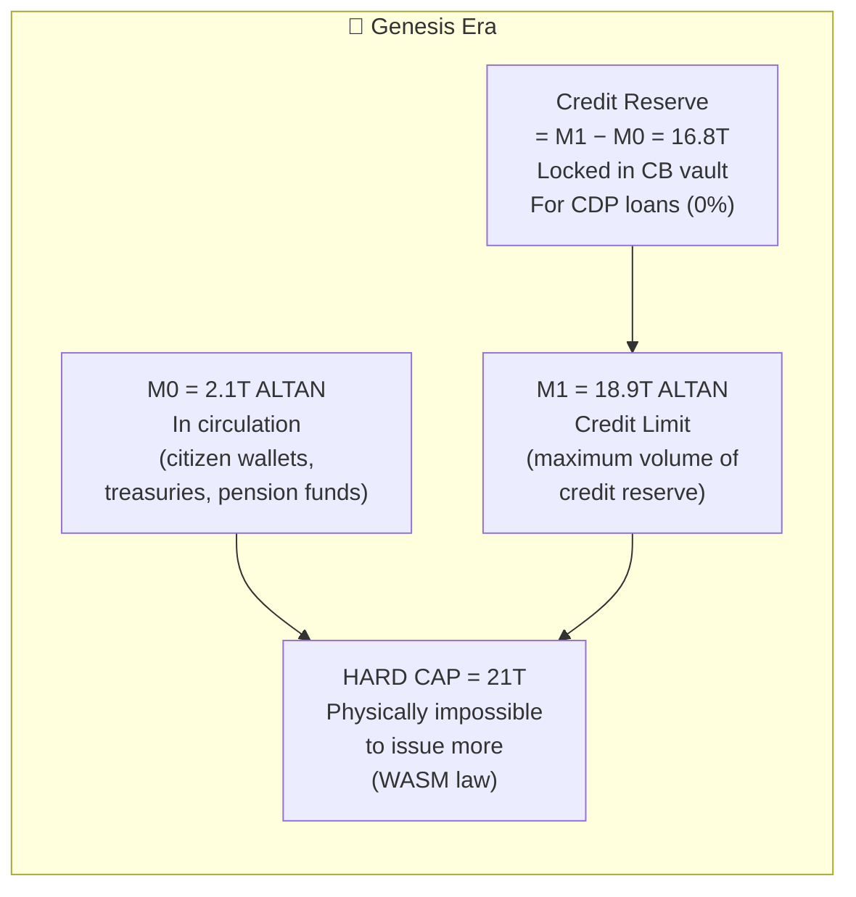
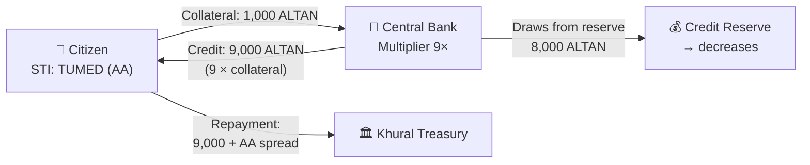
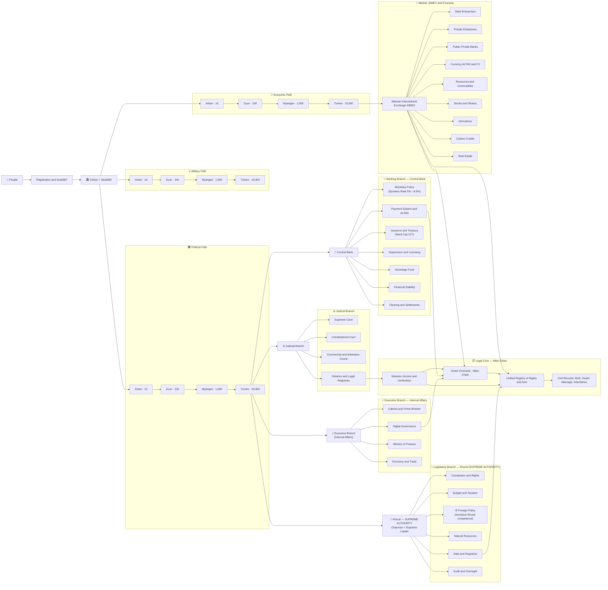

# INOMAD OS — Altan Network

<p align="center">
  
  
  
  
  
</p>

> **INOMAD OS** is a sovereign digital-state infrastructure built on Substrate, enabling decentralized governance, collateral-backed credit lines, and cross-chain liquidity through the **Cash Advance Bridge** — all governed on-chain by constitutional rules encoded directly in runtime pallets.

---

## Table of Contents

1. [Overview](#overview)
2. [Technical Architecture](#technical-architecture)
3. [Cash Advance Bridge](#cash-advance-bridge)
4. [Substrate Module Structure](#substrate-module-structure)
5. [Altan Token Economics: Epochal Credit Model](#altan-token-economics-epochal-credit-model)
6. [Algorithmic Credit Epoch Mechanics](#algorithmic-credit-epoch-mechanics)
7. [Dynamic CB Key Rate — "Code is Law"](#dynamic-cb-key-rate--code-is-law)
8. [Citizen Credit Rating System (STI)](#citizen-credit-rating-system-sti--sovereign-trust-index)
9. [Fractal Governance: Arbad → Tumed](#fractal-governance-arbad--zun--myangad--tumed)
10. [Full System Architecture](#full-system-architecture--inomad-os)
11. [L1 Altan — Single Source of Truth](#l1-altan--single-source-of-truth)
12. [Local Development Setup](#local-development-setup)
13. [Running Tests](#running-tests)
14. [Security Model](#security-model)
15. [Contributing](#contributing)
16. [License](#license)

---

## Overview

INOMAD OS implements a **layer-1 sovereign state** on Substrate with:

- **Decentralized credit lines** — collateral-backed loans issued and enforced by on-chain pallets, without external oracles or centralized risk engines.
- **Cash Advance Bridge** — a trustless mechanism allowing citizens to draw short-term liquidity against locked collateral, with automatic repayment via enforced on-chain schedules.
- **Constitutional governance** — all economic parameters (interest rates, collateral ratios, liquidation thresholds) are governed by the Khural DAO and encoded in the `pallet-constitution`.
- **Keyless sub-account architecture** — derived accounts via `Blake2_256(master ++ type_byte ++ nonce)` eliminate seed proliferation while preserving social recovery compatibility.

---

## Technical Architecture

```
┌──────────────────────────────────────────────────────────────────┐
│                        ALTAN NETWORK L1                          │
│                    (Substrate FRAME Runtime)                      │
│                                                                   │
│  ┌─────────────┐  ┌──────────────┐  ┌────────────────────────┐  │
│  │ Central Bank │  │Bank of Siberia│  │   Cash Advance Bridge  │  │
│  │  (Emission)  │  │(Credit Ops)  │  │  (Liquidity Gateway)   │  │
│  └──────┬───────┘  └──────┬───────┘  └──────────┬─────────────┘  │
│         │                 │                       │               │
│         └─────────────────┴───────────────────────┘               │
│                           │                                       │
│              ┌────────────▼───────────┐                          │
│              │    Altan Vault (MPC)   │                          │
│              │  + Social Recovery     │                          │
│              └────────────┬───────────┘                          │
│                           │                                       │
│  ┌────────────────────────▼────────────────────────────────────┐ │
│  │              Governance & Constitution Layer                 │ │
│  │  Khural DAO · InomadElections · CitizenVoice · Chancery    │ │
│  └─────────────────────────────────────────────────────────────┘ │
└──────────────────────────────────────────────────────────────────┘
         │                                          │
         ▼                                          ▼
  ┌─────────────┐                         ┌─────────────────┐
  │  Next.js    │                         │   NestJS API    │
  │  Frontend   │◄───── Polkadot.js ─────►│   (Off-chain    │
  │  (UI Layer) │                         │   Indexer/Auth) │
  └─────────────┘                         └─────────────────┘
```

### Key Design Principles

| Principle | Implementation |
|---|---|
| **Separation of Monetary Powers** | `pallet-central-bank` is sole ALTAN emitter; `pallet-bank-of-siberia` never calls `deposit_creating` directly |
| **Keyless Sub-Accounts** | Deterministic Blake2_256 derivation — no new seed phrases per account type |
| **Social Recovery Compatibility** | All ownership checks use `ensure_signed(origin)` — recovered identity inherits all sub-accounts |
| **Constitutional Enforcement** | Economic parameters are dispatchables of `pallet-constitution`, requiring supermajority Khural vote to change |
| **ZKP Privacy** | `pallet-shielded-vaults` uses Groth16 proofs for private balance operations |

---

## Cash Advance Bridge

The **Cash Advance Bridge** (CAB) is the core innovation of this grant proposal. It enables short-term, trustless liquidity draw-downs against on-chain collateral, bridging the gap between illiquid digital-state assets and immediate spending needs.

### Protocol Flow

```
  Citizen                Bank of Siberia            Central Bank
     │                        │                          │
     │── lock_collateral() ──►│                          │
     │                        │── verify_collateral() ──►│
     │                        │◄── collateral_ok ────────│
     │◄── advance_issued() ───│                          │
     │                        │                          │
     │    (uses advance)      │                          │
     │                        │                          │
     │── repay_advance() ─────►│                         │
     │                        │── unlock_collateral() ──►│
     │◄── collateral_released │◄── unlocked ─────────────│
```

### CAB Parameters (Governance-Controlled)

| Parameter | Default | Governance |
|---|---|---|
| `MaxAdvanceRatio` | 70% of collateral | Khural vote |
| `AdvanceInterestRate` | 2% / 30 days | Central Bank epoch |
| `MaxAdvanceDuration` | 90 days | Khural vote |
| `LiquidationThreshold` | 110% health ratio | Constitution pallet |
| `FreezeGracePeriod` | 72 hours | Constitution pallet |

### Liquidation Guard

If a collateral position's health ratio (`collateral_value / outstanding_advance`) drops below `LiquidationThreshold`:

1. **Freeze phase** (0–72h): Account frozen; citizen notified via on-chain event.
2. **Grace repayment** (72h window): Citizen can top-up collateral or repay advance.
3. **Forced liquidation** (>72h): `pallet-bank-of-siberia` transfers collateral to State Treasury; position closed; `AdvanceLiquidated` event emitted.

All three phases are executed by on-chain dispatchables — **no off-chain keeper bots required**.

---

## Substrate Module Structure

### Core Financial Pallets

| Pallet | Path | Description |
|---|---|---|
| `pallet-central-bank` | `pallets/central-bank/` | Primary ALTAN issuance, monetary policy epochs |
| `pallet-bank-of-siberia` | `pallets/bank-of-siberia/` | Credit lines, loans, escrow, time deposits |
| `pallet-altan-vault` | `pallets/altan-vault/` | MPC custody, keyless sub-accounts, social recovery |
| `pallet-altan-tax` | `pallets/altan-tax/` | On-chain transaction tax collection |
| `pallet-annual-profit-tax` | `pallets/annual-profit-tax/` | Annual profit tax assessment |
| `pallet-shielded-vaults` | `pallets/shielded-vaults/` | Groth16 ZKP private balance operations |

### Governance Pallets

| Pallet | Path | Description |
|---|---|---|
| `pallet-constitution` | `pallets/constitution/` | Constitutional rule storage and enforcement |
| `pallet-khural-governance` | `pallets/khural-governance/` | Parliamentary voting (Khural DAO) |
| `pallet-inomad-elections` | `pallets/inomad-elections/` | Ranked-choice election module |
| `pallet-citizen-voice` | `pallets/citizen-voice/` | Direct citizen referendum |
| `pallet-decimal-dao` | `pallets/decimal-dao/` | Conviction-weighted voting |
| `pallet-judicial-courts` | `pallets/judicial-courts/` | Dispute resolution, fine enforcement |

### Identity & Civil Registry Pallets

| Pallet | Path | Description |
|---|---|---|
| `pallet-inomad-identity` | `pallets/inomad-identity/` | Citizen identity, KYC hooks |
| `pallet-land-registry` | `pallets/land-registry/` | On-chain land title management |
| `pallet-inheritance` | `pallets/inheritance/` | Digital asset inheritance |
| `pallet-migration-center` | `pallets/migration-center/` | Cross-jurisdiction migration |
| `pallet-chancery` | `pallets/chancery/` | Official document issuance |
| `pallet-chronicles` | `pallets/chronicles/` | Immutable state history |

### Economic Activity Pallets

| Pallet | Path | Description |
|---|---|---|
| `pallet-organization` | `pallets/organization/` | Corporate entity registration |
| `pallet-guilds` | `pallets/guilds/` | Trade guild membership and fees |
| `pallet-licensing` | `pallets/licensing/` | Business license issuance |
| `pallet-bank-operator` | `pallets/bank-operator/` | Licensed bank operator registration |
| `pallet-foreign-affairs` | `pallets/foreign-affairs/` | Cross-chain treaty management |
| `pallet-forums` | `pallets/forums/` | Decentralized deliberation layer |
| `pallet-black-book` | `pallets/black-book/` | Sanctions and compliance registry |
| `pallet-steppe-offline` | `pallets/steppe-offline/` | Offline-first signed transaction queue |

### NFT & Access Pallets

| Pallet | Path | Description |
|---|---|---|
| `pallet-access-nft` | `pallets/access-nft/` | Role-based access NFTs |
| `pallet-achievement-nft` | `pallets/achievement-nft/` | Citizen achievement badges |
| `pallet-recovery-nft` | `pallets/recovery-nft/` | Social recovery guardianship tokens |

---

## Altan Token Economics: Epochal Credit Model

The economic model of INOMAD OS is based on a **hard-capped base emission** and an **algorithmic credit supply** governed by `pallet-central-bank` smart contracts.

The total maximum monetary supply (M2) in the system is hard-fixed at **21 trillion**, divided into the base asset and derivative credit supply (x9 multiplier).

### Constitutional Monetary Aggregates

```
M0 (Base Money, in circulation)      =  2,100,000,000,000 ALTAN  (2.1T)
M1 (Hard Cap, credit limit)          = 18,900,000,000,000 ALTAN  (18.9T)
────────────────────────────────────────────────────────────────────────
HARD CAP (absolute maximum)          = 21,000,000,000,000 ALTAN  (21T)
────────────────────────────────────────────────────────────────────────
Credit Reserve (M1 − M0)            = 16,800,000,000,000 ALTAN  (16.8T)
```

### Key Supply Parameters

- **Base Emission (Hardcap):** 2.1T ALTAN. Distributed exclusively among the population. This is the initial capital of citizens.
- **Credit Supply (x9 Multiplier):** 18.9T. Funds available for issuance through decentralized credit lines backed by base ALTAN collateral.
- **Total System Capacity:** 21T (2.1T + 18.9T).

### M0 / M1 System Diagram



**Key principles:**
- **M0 (2.1T)** — created once at Genesis. Distributed 90/7/3% across 83 regions. These are live ALTAN in citizen wallets.
- **M1 (18.9T)** — constitutional hard cap. Maximum credit volume the CB can ever issue.
- **Hard Cap (21T)** = M0 + M1. Absolute physical limit. Encoded in WASM runtime. `BaseCallFilter` blocks `force_set_balance` even from Root/Sudo.
- **Credit Reserve (16.8T)** = M1 − M0. Locked in the CB vault for CDP credit issuance.

### Genesis Era vs. Free Market Era

```
GENESIS ERA (current)
 ├── M0 (in circulation, distributed 90/7/3%):  2.1T ALTAN
 ├── Credit Reserve (rotating pool):            up to 18.9T ALTAN
 ├── CDP rate: 0% (constitutional WASM mandate)
 ├── Multiplier: 9× (collateral × 9 = credit)
 ├── Repayments → Khural Treasury (NOT back to reserve)
 └── Era ends when reserve → 0

FREE MARKET ERA (future)
 ├── CB Key Rate: set by CB Board (unlocked)
 ├── Citizens borrow via licensed Commercial Banks
 ├── Interest payments → refill Reserve (0 → 16.8T)
 └── When Reserve = 16.8T → Genesis Era II begins
```

---

## Algorithmic Credit Epoch Mechanics

Credit issuance operates not in continuous mode but through **economic cycles (Epochs)**, allowing the Central Bank to programmatically regulate inflation and debt load.

1. **Epoch Initialization:** Citizens lock their base ALTAN as collateral and take loans from the available credit supply (up to 18.9T in Epoch 1), forming their on-chain credit history.
2. **Epoch Completion (Limit Exhaustion):** Once the credit pool of the current epoch is fully utilized, new loan issuance stops. The current epoch and its interest rate are locked.
3. **Asynchronous Repayment:** Funds repaid by borrowers do **not** replenish the current active epoch's limit. They accumulate in the smart contract to form the pool for the next credit epoch.
4. **Dynamic Key Rate (Balancing):**
   - If Epoch 1 returns less than issued (e.g., only 17T of 18.9T returned) → **Epoch 2** launches with a 17T pool and a **raised key rate** (deflationary pressure).
   - If the accumulated credit supply recovers to the target 18.9T → the system automatically **lowers the rate** for the next epoch (stimulating new economic growth).

### Epoch Flow Diagram

```
 ┌─────────────────────────────────────────────────────────────┐
 │                 Total Supply: 21 Trillion                   │
 ├─────────────────────────────┬───────────────────────────────┤
 │ Base ALTAN (2.1T)           │ Credit Supply (18.9T)         │
 │ (Citizens / Collateral)     │ (Issued by Bank of Siberia)   │
 └─────────────┬───────────────┴───────────────┬───────────────┘
               │                               │
               ▼                               ▼
       [ Lock Collateral ] ◄────────── [ Issue Credit ]
               │                               │
               └──────────► EPOCH 1 ◄──────────┘
                      (Rate: Baseline)
                               │
                      [ Limit Exhausted ]
                               │
                               ▼
        ┌──────────────────────────────────────────────┐
        │   Debt Repayments (Accumulation for Epoch 2)  │
        └──────────────────────┬───────────────────────┘
                               │
       Repayment Deficit? (e.g., only 17T returned of 18.9T)
             │                                   │
      [ YES ] ▼                            [ NO ] ▼
 ┌───────────────────────┐             ┌───────────────────────┐
 │       EPOCH 2         │             │       EPOCH 2         │
 │ Pool: 17T             │             │ Pool: 18.9T           │
 │ Rate: RAISED          │             │ Rate: LOWERED         │
 └───────────────────────┘             └───────────────────────┘
```

---

## Dynamic CB Key Rate — "Code is Law"

The rate is **automatically computed** from current pool utilization — hardcoded in WASM, ungovernable even by Sudo:

```
Utilization = (18.9T − Credit_Reserve) / 18.9T × 100%

When utilization < 80% (optimal):
    Rate = 0% → 4.25%   (linear, encourages lending)

When utilization ≥ 80%:
    Rate = 4.25% → 8.5%  (exponential, protects reserve)

When outstanding ≥ 16.8T (monopoly barrier):
    MONOPOLY PENALTY (requires Khural vote)
```

**Constitutionally hardcoded WASM constants:**
```rust
// These values CANNOT be changed even via Sudo/Root/Khural
PROTECTION_BARRIER  = 16_800_000_000_000_000_000_000_000  // 16.8T planck
OPTIMAL_KEY_RATE    = 425   // 4.25% (basis points × 100)
OPTIMAL_UTILIZATION = 80    // 80%
MAX_KEY_RATE        = 850   // 8.5%
```

---

## Citizen Credit Rating System (STI — Sovereign Trust Index)

A citizen's credit rating determines the **spread** (premium) above the CB base rate, and unlocks higher credit limits.

| Tier | STI Range | Max Credit Limit | Credit Rating | Unlocks |
| --- | --- | --- | --- | --- |
| **CITIZEN** (None) | < 500 | 100–500 ALTAN *(Secured)* | BB | Welcome Secured Credit |
| **ARBAD** (10) | 500–599 | 1,000 ALTAN *(Unsecured)* | BBB- | Arbad creation, Unsecured loans |
| **ZUN** (100) | 600–749 | 5,000 ALTAN | BBB+ | Zun tier governance |
| **MYANGAD** (1000) | 750–899 | 20,000 ALTAN | A | Myangad tier governance |
| **TUMED** (10000) | 900–999 | 100,000 ALTAN | AA | Tumed tier governance |
| **ELDER** | 1000+ | Unlimited *(Khural vote)* | AAA | Elder status, Institutional loans |

**Credit Rating vs. Rate Table:**

| Rating | STI Level | Spread | Rate at CB=0% | Rate at CB=4.25% |
|--------|-----------|--------|---------------|--------------------|
| **AAA** | ELDER (1000+) | +0% | **0%** | 4.25% |
| **AA** | TUMED (900–999) | +1%–2% | 1%–2% | 5.25%–6.25% |
| **A** | MYANGAD (750–899) | +3%–4% | 3%–4% | 7.25%–8.25% |
| **BBB+** | ZUN (600–749) | +4%–5% | 4%–5% | 8.25%–9.25% |
| **BBB-** | ARBAD (500–599) | +5%–6% | 5%–6% | 9.25%–10.25% |
| **BB** | CITIZEN (<500) | +7%–8.5% | 7%–8.5% | 11.25%–12.75% |

STI changes: `+10` full CDP repayment · `-20` Arbad member default · `+N` Guild Quests / governance

### How CDP (Collateral Debt Position) Works



---

## Fractal Governance: Arbad → Zun → Myangad → Tumed

INOMAD OS is built on the **Chinggis Principle** — a fractal hierarchy of self-governing cells, each level autonomous and electing leaders to the next tier up.

```
CONFEDERATION KHURAL  ← one vote from each indigenous nation
        │
REPUBLICAN KHURAL (republic / region level)
        │            Tumed leaders ← elect → republic representative
        │
TUMED  (10,000 citizens = 10 × Myangad)
        │            10 Myangad leaders ← elect → Tumed leader
        │
MYANGAD (1,000 citizens = 10 × Zun)
        │            10 Zun leaders ← elect → Myangad leader
        │
ZUN    (100 citizens = 10 × Arbad)
        │            10 Arbad leaders ← elect → Zun leader
        │
ARBAD  (10 citizens) ← base cell: co-signing guarantorship, CDP, check-in
        ├── Citizen 1
        ├── Citizen 2
        └── ... (10 total)
```

### Bottom-Up Election Mechanism

```mermaid
flowchart BT
    A1["👤 Citizen 1"] & A2["👤 Citizen 2"] & A3["👤 ... × 10"] --> B["🔹 Arbad Leader\n10 members"]
    B1["🔹 Arbad Leader #1"] & B2["🔹 Arbad Leader #2"] & B3["🔹 ... × 10"] --> C["🔷 Zun Leader\n100 members"]
    C1["🔷 Zun Leader #1"] & C2["🔷 Zun Leader #2"] & C3["🔷 ... × 10"] --> D["🔺 Myangad Leader\n1,000 members"]
    D1["🔺 Myangad Leader #1"] & D2["🔺 Myangad Leader #2"] & D3["🔺 ... × 10"] --> E["⭐ Tumed Leader\n10,000 members"]
    E1["⭐ Tumed Leader #1"] & E2["⭐ Tumed Leader #2"] & E3["⭐ ... × N"] --> F["🏛️ Republican Khural\nregion level"]
    F1["🏛️ Rep. Khural #1"] & F2["🏛️ Rep. Khural #2"] & F3["🏛️ ... each nation"] --> G["🌐 Confederation Khural\n1 vote = 1 indigenous nation"]
```



**Principle:** Elections flow **bottom-up** — no one is appointed from above. **On-chain implementation:** `pallet-decimal-dao` · `pallet-inomad-elections` · every election = on-chain transaction.

---

## Full System Architecture — INOMAD OS



| Block | Description |
|-------|-------------|
| **👤 People → Citizen + SeatSBT** | Single entry point: registration via SubWallet, NFT seat (SeatSBT) |
| **⚔️ Military Path** (Arban→Zuun→Myangan→Tumen) | Fractional military hierarchy |
| **💼 Economic Path** (Arban→…→Tumen) | Production and trade hierarchy; output — SIMEX Exchange |
| **🏛️ Political Path** (Arban→…→Tumen) | Civic self-governance; apex — Khural (Supreme Legislative) |
| **🏦 Central Bank** | 7 departments: Monetary Policy · ALTAN · Issuance · Supervision · Fund · Stability · Clearing |
| **⚖️ Judicial Branch** | Supreme Court to Notaries |
| **📋 Legal Core** | Altan Chain: Smart Contracts → Unified Registry → Civil Records → Notaries |

---

## L1 Altan — Single Source of Truth

> **All monetary state, identity, governance, and economic actions are authoritative only when confirmed on-chain.**
> NestJS backends and PostgreSQL are **read-cache** layers — never the primary source.

```
╔══════════════════════════════════════════════════════════════════════════════╗
║              ALTAN L1 — SUBSTRATE RUNTIME (Rust WASM)                      ║
║                    wss://node.inomad.life/ws                                ║
║                                                                             ║
║  ┌─────────────────┐  ┌──────────────────┐  ┌──────────────────────────┐   ║
║  │ pallet_balances │  │ pallet_altan_tax │  │  pallet_central_bank     │   ║
║  │ ALTAN transfers │  │ 0.03% P2P tax    │  │  18.9T Rotating Pool     │   ║
║  │ Hard cap: 21T   │  │ → Khural Treasury│  │  Dynamic rate 0%→8.5%    │   ║
║  └────────┬────────┘  └────────┬─────────┘  └────────────┬─────────────┘   ║
║           │                   │                          │                  ║
║  ┌────────▼────────────────────▼──────────────────────────▼─────────────┐   ║
║  │            BLOCKCHAIN EVENT BUS (Substrate Runtime Events)           │   ║
║  │  Transfer · FeesCollected · CreditIssued · SeatIssued · QuestTaken   │   ║
║  └────────────────────────────────┬──────────────────────────────────────┘  ║
╚═══════════════════════════════════╪═════════════════════════════════════════╝
                                    │  WebSocket RPC (wss://)
                    ┌───────────────┴──────────────────┐
                    │                                  │
       ┌────────────▼────────────┐       ┌─────────────▼────────────┐
       │  CHAIN BACKEND          │       │  MAIN BACKEND             │
       │  BlockchainSyncService  │       │  SubstrateService         │
       │  (event → Prisma cache) │       │  CentralBankService       │
       └────────────┬────────────┘       └─────────────┬────────────┘
                    │                                   │
                    └──────────────┬────────────────────┘
                                   │  REST / Prisma (PostgreSQL)
                    ┌──────────────▼────────────────────┐
                    │     POSTGRESQL DB                  │
                    │     READ CACHE — not source truth  │
                    │     Synced from L1 events          │
                    └──────────────┬────────────────────┘
                                   │  REST API
                    ┌──────────────▼────────────────────┐
                    │     FRONTEND — Next.js             │
                    └───────────────────────────────────┘
                              │  @polkadot/extension-dapp
                    ┌─────────▼─────────┐
                    │  CITIZEN WALLET   │
                    │  SubWallet        │
                    │  signs extrinsics │
                    └───────────────────┘
```

| Layer | Role | Technology |
|---|---|---|
| **L1 Altan Substrate** | 🔴 **AUTHORITATIVE** — immutable on-chain state | Rust WASM, GRANDPA+Aura |
| **Chain Backend** | Indexer — syncs L1 events to DB | NestJS · Railway |
| **Main Backend** | API proxy — reads L1 or DB fallback | NestJS · Railway · 120+ modules |
| **PostgreSQL** | Read cache — eventually consistent with L1 | Prisma ORM · 40+ models |
| **Frontend** | Citizen UI — reads backend; signs on L1 | Next.js + SubWallet |

---

## Local Development Setup

### Prerequisites

| Tool | Version |
|---|---|
| Rust | `stable` (see `rust-toolchain.toml`) |
| Cargo | Bundled with Rust |
| Node.js | `≥ 20.x` |
| npm | `≥ 10.x` |
| PostgreSQL | `≥ 15.x` |

### 1. Clone and Setup Environment

```bash
git clone https://github.com/YOUR_ORG/altan-network.git
cd altan-network

# Copy environment template — fill in your own values
cp backend/.env.example backend/.env
```

### 2. Build the Substrate Node

```bash
# Install Rust wasm target
rustup target add wasm32-unknown-unknown

# Build in release mode (takes ~10–20 min first time)
cd altan-network
cargo build --release

# Verify build
./target/release/altan-node --version
```

### 3. Start a Local Development Chain

```bash
# Start a single-node local chain with Alice as validator
./target/release/altan-node \
  --dev \
  --tmp \
  --rpc-external \
  --rpc-cors=all \
  --rpc-port=9944
```

You can now connect to the chain via [Polkadot.js Apps](https://polkadot.js.org/apps/?rpc=ws://localhost:9944).

### 4. Start the Backend (NestJS)

```bash
cd backend
npm install

# Run database migrations
npx prisma migrate dev

# Start backend in development mode
npm run start:dev
```

Backend API will be available at `http://localhost:3001`.

### 5. Start the Frontend (Next.js)

```bash
cd ..   # project root
npm install
npm run dev
```

Frontend will be available at `http://localhost:3000`.

---

## Running Tests

### Substrate Pallet Unit Tests

```bash
cd altan-network

# Run all pallet tests
cargo test --workspace

# Run a specific pallet
cargo test -p pallet-bank-of-siberia

# Run with output (for debugging)
cargo test -p pallet-bank-of-siberia -- --nocapture
```

### Backend Unit & Integration Tests

```bash
cd backend

# Unit tests
npm run test

# Integration tests (requires running PostgreSQL)
npm run test:e2e

# Coverage report
npm run test:cov
```

### Frontend Tests (Playwright E2E)

```bash
# From project root
npx playwright test
```

---

## Security Model

The security of INOMAD OS relies on three pillars:

1. **On-chain enforcement** — Liquidation, fine collection, and collateral management are dispatchables; they require no off-chain keepers and are auditable by any network participant.

2. **Constitutional constraints** — Critical parameters (collateral ratios, interest rates, taxation) can only be changed via supermajority Khural vote (`pallet-constitution`), preventing unilateral admin manipulation.

3. **Keyless account derivation** — Citizen sub-accounts have no private key; they are controlled exclusively by the master account. This eliminates a class of key-theft attacks against secondary wallets.

For responsible disclosure of security vulnerabilities, see [SECURITY.md](./SECURITY.md).

---

## Contributing

We welcome contributions from the Polkadot/Substrate community. Please read [CONTRIBUTING.md](./CONTRIBUTING.md) before opening a pull request.

**Code of Conduct**: We follow the [Rust Code of Conduct](https://www.rust-lang.org/policies/code-of-conduct).

---

## License

Copyright 2024–2026 INOMAD OS Contributors

Licensed under the Apache License, Version 2.0 (the "License");
you may not use this file except in compliance with the License.
You may obtain a copy of the License at

http://www.apache.org/licenses/LICENSE-2.0

Unless required by applicable law or agreed to in writing, software distributed under the License is distributed on an "AS IS" BASIS, WITHOUT WARRANTIES OR CONDITIONS OF ANY KIND, either express or implied. See the [LICENSE](./LICENSE) file for the full license text.
